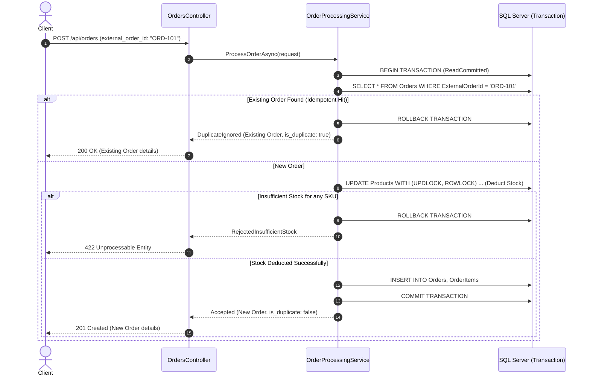

# Architecture & Technical Design Document: Orders & Inventory Service

## 1. Executive Summary & Architecture Overview

The `OrdersAndInventoryService` is designed following **Clean Architecture** (Ports & Adapters / Onion Architecture) and domain-driven design principles in **.NET 8**. The primary goals are:
1. **Absolute Data Integrity & Concurrency Safety**: Guaranteed non-negative inventory (`Stock >= 0`) and zero overselling even under heavy concurrent load.
2. **Strict Idempotency**: Safe re-submission of orders using unique external order IDs without corrupting state or double-decrementing stock.
3. **High-Performance Reporting**: Aggregated daily sales reporting leveraging optimized indexing and raw SQL execution via Dapper.
4. **Operational Observability**: Health checks, structured JSON logging with Serilog, and standardized ProblemDetails error handling.

```
┌──────────────────────────────────────────────────────────┐
│                   OrdersAndInventory.Api                 │
│   (Controllers, Middlewares, Serilog, HealthChecks)      │
└────────────────────────────┬─────────────────────────────┘
                             │
                             ▼
┌──────────────────────────────────────────────────────────┐
│               OrdersAndInventory.Application             │
│   (Services, CQRS-Style Use Cases, DTOs, Validators)     │
└───────────────────────┬──────────────┬───────────────────┘
                        │              │
                        ▼              │
┌───────────────────────────────┐      │
│   OrdersAndInventory.Domain   │      │
│  (Entities, Invariants, Ex)   │      │
└───────────────────────────────┘      ▼
                        ▲  ┌───────────────────────────────────────────────────┐
                        │  │          OrdersAndInventory.Infrastructure        │
                        └──┤   (EF Core DbContext, Dapper, SQL Server, Migr)   │
                           └───────────────────────────────────────────────────┘
```

---

## 2. Layer Responsibilities & Folder Structure

### `src/OrdersAndInventory.Domain`
Contains the core business domain entities, aggregate roots, value objects, and domain exceptions. It has **zero dependencies** on external libraries, frameworks, or databases.
- `Entities/Product.cs`: Encapsulates invariants (non-negative stock, non-negative price, SKU normalization).
- `Entities/Order.cs`: Aggregate root managing order items and total price calculation.
- `Entities/OrderItem.cs`: Child entity calculating item sub-totals.
- `Enums/OrderStatus.cs`, `Enums/OrderProcessingOutcome.cs`: Domain status enumerations.
- `Exceptions/`: Domain-specific exceptions (`InsufficientStockException`, `ProductNotFoundException`, `DuplicateOrderException`, `DomainValidationException`).

### `src/OrdersAndInventory.Application`
Contains application business logic, orchestration, validation, and contracts.
- `Services/ProductService.cs`: Manages product creation and manual stock adjustments.
- `Services/OrderProcessingService.cs`: Coordinates the multi-step transactional order placement with idempotency and atomic stock deduction.
- `Validators/`: FluentValidation validators enforcing structural correctness before execution.
- `DTOs/`: Data transfer contracts for products, orders, and sales reporting.
- `Common/Interfaces/`: Port interfaces (`IApplicationDbContext`, `IInventoryRepository`, `ISalesReportService`, `IDataSeeder`, `IDateTimeProvider`).

### `src/OrdersAndInventory.Infrastructure`
Contains the data access adapters, database configurations, migrations, and low-level SQL optimization.
- `Persistence/ApplicationDbContext.cs`: EF Core database context configured with table constraints, indexes, and precision settings.
- `Persistence/Repositories/InventoryRepository.cs`: High-concurrency repository using Dapper and SQL Server row locks (`UPDLOCK, ROWLOCK`).
- `Persistence/Services/DapperSalesReportService.cs`: Fast Dapper aggregation query for daily sales summarization.
- `Persistence/DataSeeder.cs`: Automated DB seeder executing in `Development` mode when the database is empty.
- `Migrations/`: Initial migration and database model snapshots.

### `src/OrdersAndInventory.Api`
The HTTP delivery mechanism and host.
- `Controllers/`: `ProductsController`, `OrdersController`, `SalesController`.
- `Middlewares/ExceptionHandlingMiddleware.cs`: Maps domain exceptions into standardized RFC 7807 Problem Details.
- `Program.cs`: Configures DI wiring, Serilog structured JSON logging, Swagger, and ASP.NET Core Health Checks.

---

## 3. Concurrency & Locking Strategy

### High-Concurrency Stock Deduction
Overselling occurs when two or more concurrent requests read the same stock value simultaneously and both proceed to deduct, pushing inventory below zero. 

To guarantee consistency under intense concurrency, the system applies a **defense-in-depth strategy**:

1. **Database Check Constraint**:
   ```sql
   CONSTRAINT CK_Products_Stock_NonNegative CHECK ([Stock] >= 0)
   ```
   Enforced at the relational engine level, guaranteeing that under no circumstances can invalid data enter the database.

2. **Atomic Single-Statement Deductions with Row-Level Locking**:
   Rather than fetching an entity into memory, modifying it, and calling `SaveChanges()` (which is prone to lost updates or optimistic concurrency retry storms), we execute an atomic SQL update within the transaction:
   ```sql
   UPDATE Products WITH (UPDLOCK, ROWLOCK)
   SET Stock = Stock - @Quantity, UpdatedAtUtc = @UpdatedAtUtc
   WHERE Sku = @Sku AND Stock >= @Quantity;
   ```
   - `WITH (UPDLOCK, ROWLOCK)` acquires an update lock on the specific product row immediately, preventing race conditions.
   - The predicate `Stock >= @Quantity` ensures that the deduction only occurs if sufficient inventory exists.
   - If `rowsAffected == 0`, the application knows immediately that either the SKU does not exist or stock is insufficient.

3. **Deadlock Avoidance in Multi-Item Orders**:
   When an order contains multiple products (e.g. SKU `A` and SKU `B`), concurrent transactions attempting to acquire locks in reverse orders (`A -> B` vs `B -> A`) can deadlock.
   To eliminate this risk, `OrderProcessingService` deterministically **sorts all requested SKUs alphabetically** before acquiring locks:
   ```csharp
   var consolidatedItems = request.Items
       .GroupBy(i => i.Sku.Trim().ToUpperInvariant())
       .Select(...)
       .OrderBy(x => x.Sku)
       .ToList();
   ```

---

## 4. Idempotency Mechanics

Network timeouts, client retries, and duplicate webhook submissions can cause duplicate charges and double stock deductions without idempotency guarantees.

### Idempotency Flow



### Guarantees
1. **Unique Index**: `Orders(ExternalOrderId)` has a unique nonclustered index (`IX_Orders_ExternalOrderId`).
2. **Transaction Boundary**: The idempotency check, stock deduction, and order insertion occur within a single database transaction.
3. **Concurrent Race Protection**: If two identical requests hit the service at the exact same millisecond, the first commits and the second catches the unique index violation exception (`DbUpdateException`), rolls back, loads the newly committed order, and returns `200 OK` with `is_duplicate: true`.

---

## 5. Sales Reporting Query Performance & Indexing Strategy

### The Query Challenge
`GET /api/sales/daily-summary?startDate=...&endDate=...` requires grouping millions of order items across dates and products, calculating per-product quantities and gross sales, as well as day-level aggregate totals.

### Indexing Architecture
1. **`IX_Orders_PlacedAtUtc` on `Orders(PlacedAtUtc)`**:
   Allows an index seek on date range boundaries:
   `WHERE o.PlacedAtUtc >= @StartUtc AND o.PlacedAtUtc < @EndUtcExclusive`
2. **`IX_OrderItems_OrderId_ProductSku` on `OrderItems(OrderId, ProductSku)`**:
   Provides a composite cover for the join between `Orders` and `OrderItems` and supports index-level grouping on `ProductSku`.

### Dapper Query Implementation
```sql
SELECT 
    CONVERT(VARCHAR(10), o.PlacedAtUtc, 23) AS [SalesDate],
    oi.ProductSku AS [Sku],
    SUM(oi.Quantity) AS [QuantitySold],
    SUM(oi.TotalPrice) AS [GrossSales]
FROM Orders o WITH (NOLOCK)
INNER JOIN OrderItems oi WITH (NOLOCK) ON o.Id = oi.OrderId
WHERE o.PlacedAtUtc >= @StartUtc AND o.PlacedAtUtc < @EndUtcExclusive
GROUP BY CONVERT(VARCHAR(10), o.PlacedAtUtc, 23), oi.ProductSku
ORDER BY CONVERT(VARCHAR(10), o.PlacedAtUtc, 23) ASC, oi.ProductSku ASC;
```

**Why this design excels:**
- **Zero ORM Overhead**: Dapper streams tabular aggregated results directly from SQL Server into memory with minimal allocations.
- **Single Roundtrip**: The database performs the heavy grouping and sum aggregation. The application then groups by `SalesDate` in memory in O(N) time to produce both product totals and daily grand totals.
- **No Table Locks**: `WITH (NOLOCK)` allows non-blocking reads during sales queries without contending with active checkout transactions.

---

## 6. Operational Readiness & Observability

### Structured JSON Logging (Serilog)
Every order attempt logs an explicit outcome:
- **`Accepted`**:
  ```json
  {"Outcome": "Accepted", "ExternalOrderId": "ORD-001", "OrderId": "...", "TotalAmount": 309.97, "ItemCount": 2}
  ```
- **`DuplicateIgnored`**:
  ```json
  {"Outcome": "DuplicateIgnored", "ExternalOrderId": "ORD-001", "ExistingOrderId": "...", "TotalAmount": 309.97}
  ```
- **`RejectedInsufficientStock`**:
  ```json
  {"Outcome": "RejectedInsufficientStock", "ExternalOrderId": "ORD-002", "Sku": "PROD-KEYBOARD-RGB", "RequestedQty": 9999, "AvailableStock": 50}
  ```

### Health Checks
- **`/health` (Liveness)**: Basic check verifying the Web API process is alive.
- **`/health/ready` (Readiness)**: Verifies active connectivity to Microsoft SQL Server via `AddDbContextCheck<ApplicationDbContext>()`.

---

## 7. Verification & Test Suite Summary

The solution contains **35 automated tests** across two dedicated test projects:
- **`OrdersAndInventory.UnitTests` (23 tests)**: Unit testing for domain logic, stock boundary invariants, aggregate roots, validation rules, and service exceptions.
- **`OrdersAndInventory.IntegrationTests` (12 tests)**: End-to-end integration testing executing real HTTP requests against the controller endpoints:
  - Product creation and retrieval
  - Manual stock adjustments
  - Idempotent order placement (verifying `is_duplicate` and zero redundant stock deduction)
  - Insufficient stock rejection
  - **High-concurrency test**: 10 simultaneous tasks competing for 3 scarce items, verifying that exactly 3 succeed and 7 are rejected without overselling.
  - Daily sales reporting aggregation accuracy
  - Liveness and readiness health checks
